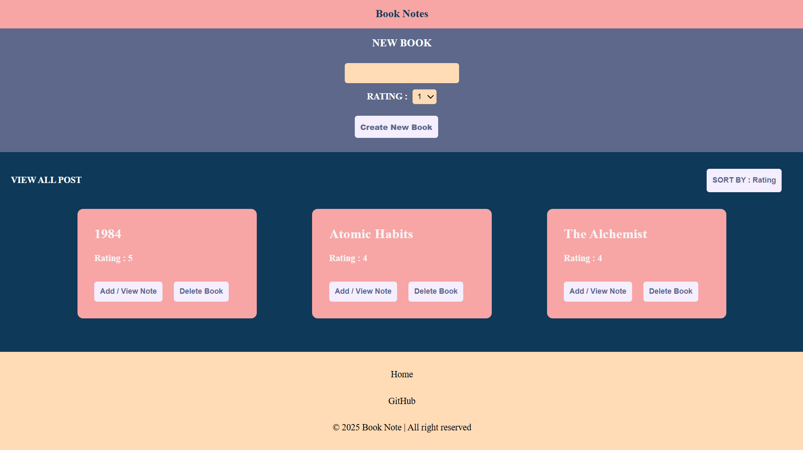
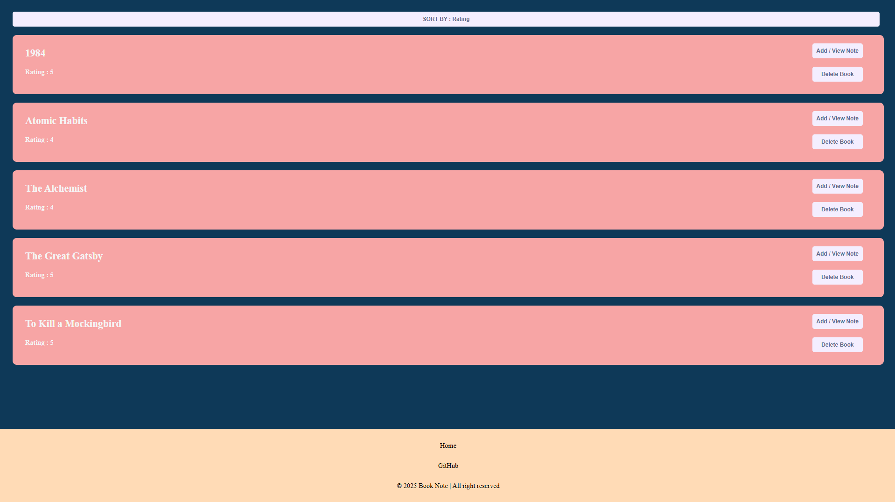
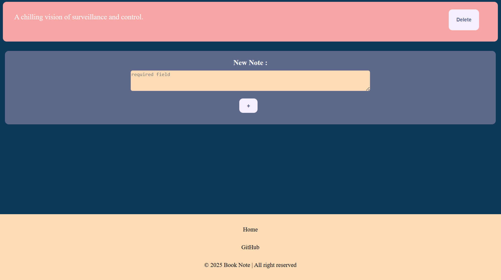

# 📚 Books Notes

**Books Notes** is a simple web application to manage books and their associated notes. Users can add, view, and delete books, as well as add and delete notes for each book. The app supports sorting books by name (A-Z) or rating.

---

## 🌟 Features

- Add new books with ratings.  
- View all books with details (name and rating).  
- Sort books by **name (A-Z)** or **rating**.  
- Add notes to individual books.  
- Delete notes or entire books along with associated notes.  
- Responsive and interactive frontend with dynamic content rendering.  

---

## 🛠 Technology Stack

- **Frontend:** HTML, CSS, JavaScript (Vanilla JS)  
- **Backend:** Node.js, Express.js, TypeScript  
- **Database:** PostgreSQL  
- **Other:** Fetch API for client-server communication  

---

## Installation

### 1. Setup PostgreSQL

1. **Install PostgreSQL**  
   [Download PostgreSQL](https://www.postgresql.org/download/) and follow instructions for your OS.  

2. **Create Database:**  
   - Use the SQL setup scripts inside the `db_setup` folder.  
   - Import `books_sampler.csv` into the `books` table.  
   - Import `note_sampler.csv` into the `notes` table.  

3. **Verify Connection:**  
   - Check using pgAdmin.

  
### 2. Setup Node.js & NPM

1. **Install Node.js & npm**  

   - **Ubuntu/Debian (Linux):**  
     ```bash
     sudo apt update
     sudo apt install nodejs npm
     ```
   - **Mac (Homebrew):**  
     ```bash
     brew install node
     ```
   - **Windows:** [Download Node.js](https://nodejs.org/)  

   **Verify installation:**  
   ```bash
   node -v
   npm -v


2. **Clone this repository** (preferred terminal: Bash):  
    ```bash
        git clone https://github.com/Sohammitra777/Book_Notes.git
        cd bookNotes
    ```

3. **Install dependencies:**  
    ```bash
        npm install
    ```
- Dependencies can be viewed inside `package.json`.  
- After installation, a new directory `node_modules` will be created.  

## ▶️ Usage

Run the server using:  
```bash
    npm run build
```

Run the server perpetually using:  
```bash
    npm run dev
```

Then open your browser and go to:  
```
    http://localhost:3000
```

---

## 📸 Screenshots

1. **Homepage Screenshot**
  
2. **All Books Page Screenshot**
 
3. **All Notes of selected Books Screenshort** 


---

## 📂 Project Structure

```
books-notes/
│
├─ db_sampler/ # Sample CSV files for importing data
│ ├─ book_sample.csv
│ └─ note_sample.csv
│
├─ node_modules/ # Node.js dependencies
│
├─ public/ # Frontend files
│ ├─ bookDetail/
│ │ ├─ bookDetail.html
│ │ ├─ bookDetail.js
│ │ └─ style.css
│ ├─ noteDetail/
│ │ ├─ noteDetail.html
│ │ ├─ notedetail.js
│ │ └─ style.css
│ ├─ images/
│ │ ├─ allbooks.png
│ │ ├─ allnotes.png
│ │ └─ Homepage.png
│ ├─ index.html
│ ├─ index.js
│ └─ style.css
│
├─ util/
│ └─ util.js # Utility functions (URL, fetch helpers)
│
├─ src/
│ ├─ controller/ # Express route controllers
│ │ ├─ deletePath.ts
│ │ ├─ getPath.ts
│ │ ├─ index.ts
│ │ └─ postPaths.ts
│ ├─ db/
│ │ ├─ db.ts # PostgreSQL connection
│ │ ├─ querie.ts # DB queries (select, insert, delete)
│ │ └─ user.ts
│ └─ route/
│ └─ userRoute.ts
│
├─ server.ts # Express server setup
├─ .env # Environment variables
├─ .gitignore
├─ package.json
├─ package-lock.json
├─ tsconfig.json
└─ README.md
```

## 📜 License
No license created — this project is only for **learning purposes**.  